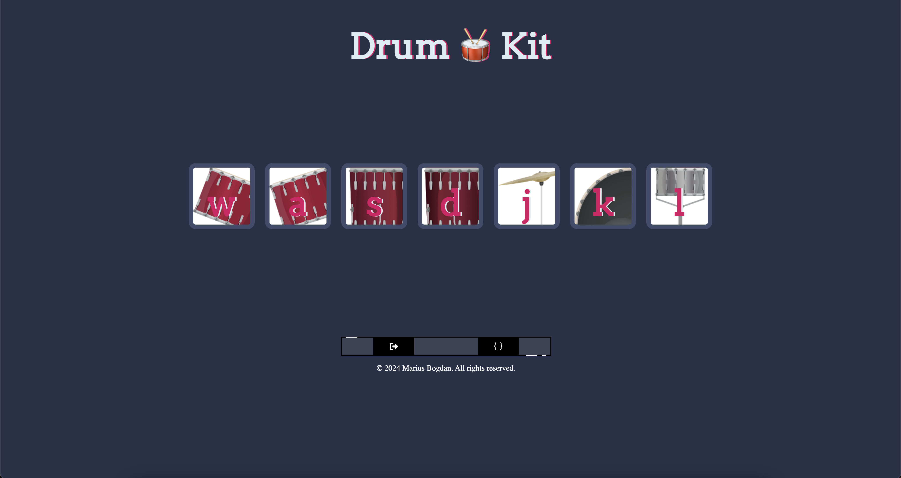

# Drum Kit

[](#)
> An interactive web-based drum kit that lets users play drum sounds by pressing keys on their keyboard.

## Overview

**Drum Kit** is a dynamic web application that allows users to create drum beats using their keyboard. Each key corresponds to a specific drum sound, providing an intuitive and engaging way to play music.

## Preview

<p align="center">
  
</p>

## Features

- **Interactive Drumming:** Play drum sounds by pressing designated keys.
- **Audio Feedback:** Each key triggers a specific sound for an immersive experience.

## Live Demo

**Explore the live version here:** [View Live Demo](https://marius-bogdan.com/projects/drum-kit/)

## Local Setup

1. **Clone** the repository:
   ```bash
   git clone https://github.com/MIBogdan/drum-kit.git
   ```
2. **Open** the `index.html` file in your browser
   *- or use a local development server (like VS Code Live Server) for a smoother development experience.*

---

## Author

**Marius Bogdan**  
[Personal portfolio](https://marius-bogdan.com/)

Feel free to reach out for any questions or collaborations!

## License

This project is provided for testing and demonstration purposes only. All rights are reserved. No part of this project may be redistributed, reuploaded, or used in any manner (commercially or otherwise) without explicit written permission from the author.
